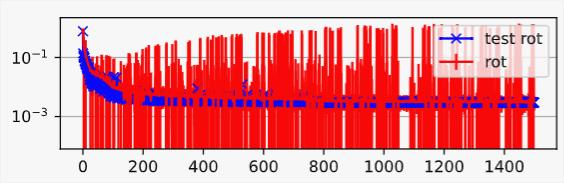
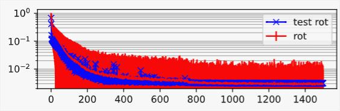

# Recent Changes

## Post Train Quantization
* Added to onnx export.
* Minimal accuracy loss for ResNet18 model. MobileNet variant becomes too noisy and is probably unusable.
* Inference time reduced to ca. 60% of float32 original.

## Variance Parameterization
* Back to earlier implementation: 
    - Use "smoothclip" func to force diagonals of covariance factors positive.
    - Overparameterize with scale factor that is applied to all covariances.
* Remove BN

## Training
* Exponential LR warmup
* Train variance parameters 10x slower
* First train without NLL losses. After LR warmup, ramp up the weight of NLL losses.
* Add the "shape plausibility loss" back in. It's based on a GMM probability density for the face shape parameters.
* The warmup changes helped to get:
    - Decent performance without BN in the variance heads
    - Smoother loss curves than before

Curve of rotation loss at time of publication:

Now:

## Model
* Add back learnable local pose offsets (Looks like it doesn't help)
* Simplify ONNX graph
* Store model config in checkpoint. Allows loading without having to know the config in advance.

## Evaluation
* Add evaluation of 2d NME for 68 landmark AFLW2000-3D benchmark.
* 