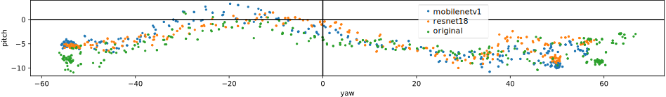
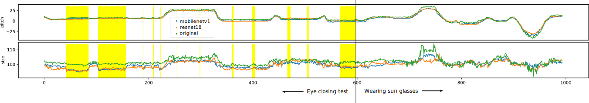
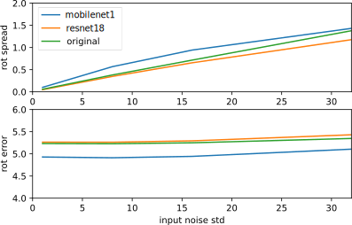

## Analysis of New Models

Designations of the models in the section below:

* "resnet18" is the network in `head-pose-0.2-big.onnx`.
* "mobilenetv1" is the network in `head-pose-0.2-small.onnx`.
* "Original" means the first model released with opentrack.

### Error Metrics

The following table shows error metrics computed from the AFLW 2000 3D dataset. The numbers are generally mean absolute deviations from ground truth. First euler angles, then the average over the 3 angles, then "geodesic" - the magnitude of the shortest rotation arc, then position and size relative to the width of the bounding box.

| Model       |   Yaw° |   Pitch° |   Roll° |   Mean° |   Geodesic° |   XY% |   S% |
|-------------|--------|----------|---------|---------|-------------|-------|------|
| mobilenetv1 |  **4.51** |     **2.81** |    **2.75** |    **3.36** |       **5.47** |  2.78 | **3.37** |
| resnet18    |   4.72 |     2.91 |    2.80 |    3.48 |        5.65 |  2.89 | 3.47 |
| original    |   4.63 |     3.01 |    3.06 |    3.57 |        5.60 |  **2.56** | 3.40 |

The models perform quite decently compared to the best models from the literature. Take a look for example at the list at https://paperswithcode.com/sota/head-pose-estimation-on-aflw2000. For convenience I reprinted the recent state of the art here.

| Mean°| Paper Title | Publication Date |
|------|-------------|------------------|
| 3.25 | DSFNet: Dual Space Fusion Network for Occlusion-Robust 3D Dense Face Alignment | 2023 |
| 3.35 | Synergy between 3DMM and 3D Landmarks for Accurate 3D Facial Geometry | 2021 |
| 3.66 | DAD-3DHeads: A Large-scale Dense, Accurate and Diverse Dataset for 3D Head Alignment from a Single Image | 2022 |

Note that the "original" model was trained on the test data, whereas the new models aren't! This makes the comparison unfair in favor of the original model.

### Pitch vs Yaw Bias

Further down is plot of pitch vs yaw - both estimated by the network - where I tried to turn my head without pitching. Hence, what is expected is a horizontal scatter plot plus some noise on the pitch-axis.

However, the networks have some systematic pitch oscillations, also reported by users. How much here is true motion and how much is error is not quite clear though. Still, the new models seem to be slightly less oscillating.

On a side remark, I suspect the asymmetry between negative and positive yaw comes from the illumination in the video feed.

### Blink Bias and Wearing Sunglasses

Next we have plots of pitch and size estimation vs. time, taken from a video of me with eyes closed (yellow sections) and wearing sunglasses.

The pitch jumps are disturbing. Even the little bit from the original model near the beginning of the sequence. On the other hand, the size estimation of the original model at this place is much better. There has been a regression indeed. However, from my experience, the deflection made by the new models can be filtered out.

Furtheremore, the new models are both less noisy where I wore glasses. The original model could even loose track when ran closed loop. Also reported by users, IIRC. The new models should be better.

### Noise Rejection

In this section we can see how networks perform as the input images get noisier and noisier. This is important for low light conditions.

Imagine a "cloud" of input images, each with added noise. Each of those samples will created a new prediction, all of which form a "cloud" as well. Mathematically we'd speak of probability distributions. As users we experience one sample from this distribution per time step.

In the following plots, only rotation is considered. The bottom plot shows the error of this "rotation cloud" as a whole from ground truth. The top plot shows how wide the cloud gets. The lower the curve, the better. The x-axis shows the standard deviation of the added input noise. Units on the y-axis are degrees.

So the resnet18 model is about 0.3° better noise wise. To put this into perspective, when you extend your arm, the width of your thumb spans about 2°.

## Conclusions

Try the small model. It seems more accurate than the old one. In low light conditions, the big model is worth a try.